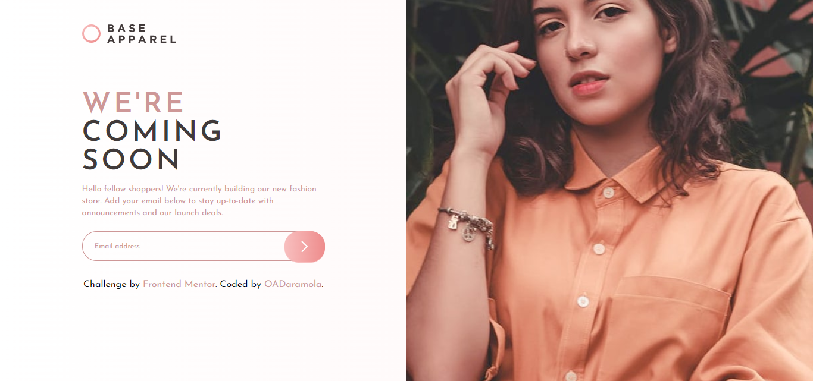

# Frontend Mentor - Base Apparel coming soon page solution

This is a solution to the [Base Apparel coming soon page challenge on Frontend Mentor](https://www.frontendmentor.io/challenges/base-apparel-coming-soon-page-5d46b47f8db8a7063f9331a0). Frontend Mentor challenges help you improve your coding skills by building realistic projects. 

## Table of contents

- [Overview](#overview)
  - [The challenge](#the-challenge)
  - [Screenshot](#screenshot)
  - [Links](#links)
- [My process](#my-process)
  - [Built with](#built-with)
  - [What I learned](#what-i-learned)
  - [Continued development](#continued-development)
  - [Useful resources](#useful-resources)
- [Author](#author)
- [Acknowledgments](#acknowledgments)

**Note: Delete this note and update the table of contents based on what sections you keep.**

## Overview

### The challenge

Users should be able to:

- View the optimal layout for the site depending on their device's screen size
- See hover states for all interactive elements on the page
- Receive an error message when the `form` is submitted if:
  - The `input` field is empty
  - The email address is not formatted correctly

### Screenshot

### Links

- Solution URL: [Add solution URL here](https://www.frontendmentor.io/challenges/base-apparel-coming-soon-page-5d46b47f8db8a7063f9331a0/hub)
- Live Site URL: [Add live site URL here](https://base-apparel-frontendmentor1.vercel.app/)

## My process

### Built with

- Semantic HTML5 markup
- CSS custom properties
- Flexbox
- CSS Grid
- Mobile-first workflow
- [Vue](https://vuejs.org/) - JS library
- [Vitest](https://vitest.dev/) - Test Framework
- [Vue Test Utils](https://test-utils.vuejs.org/) - Test Library
- [Vitest UI](https://vitest.dev/guide/ui) - Vitest UI Library
- [TailwindCSS](https://v2.tailwindcss.com/) - For styles

## Author

- Website - [Oluwatosin A Daramola](https://medium.com/@oadaramola)
- Frontend Mentor - [@Heph-zibah](https://www.frontendmentor.io/profile/Heph-zibah)
- Twitter - [@undaunted_pen](https://www.twitter.com/undaunted_pen)

